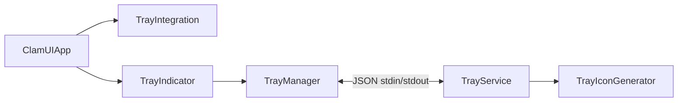

ClamUI keeps the GTK4/libadwaita application and the tray service in separate processes. The main process stays usable if the tray crashes; the tray service is GTK-independent and communicates through newline-delimited JSON on stdin/stdout.

## Responsibilities

| Component | Responsibility |
| --- | --- |
| [`src/app.py`](https://github.com/linx-systems/clamui/blob/master/src/app.py) | Application lifecycle and tray callbacks |
| [`src/tray_integration.py`](https://github.com/linx-systems/clamui/blob/master/src/tray_integration.py) | Menu action logic and device-scan events |
| [`src/ui/tray_indicator.py`](https://github.com/linx-systems/clamui/blob/master/src/ui/tray_indicator.py) | Compatibility wrapper that wires callbacks |
| [`src/ui/tray_manager.py`](https://github.com/linx-systems/clamui/blob/master/src/ui/tray_manager.py) | Subprocess lifecycle, validated IPC, GLib handoff |
| [`src/ui/tray_service.py`](https://github.com/linx-systems/clamui/blob/master/src/ui/tray_service.py) | GIO SNI and DBusMenu service |
| [`src/ui/tray_icons.py`](https://github.com/linx-systems/clamui/blob/master/src/ui/tray_icons.py) | 22px status icons: Pillow badge composition with lazy SVG rasterization through GdkPixbuf's librsvg loader; no GTK dependency |

`TrayManager` launches `TrayService` with `sys.executable`, reads stdout/stderr on background threads, and schedules GTK-visible state changes with `GLib.idle_add()`. Shared manager state uses a lock. Shutdown sends `quit`, allows two seconds, then terminates/kills only if necessary.

## D-Bus and icons

`TrayService` registers `/StatusNotifierItem` with the session watcher through GIO and exports DBusMenu at `/MenuBar`. It probes x, KDE, and freedesktop watcher names. `TrayIconGenerator` rasterizes SVG bases lazily through GdkPixbuf's librsvg loader and composes status badges with Pillow. Custom icon PNGs are published through `IconPixmap`/`AttentionIconPixmap` first; theme icon names are fallback only. This prevents sandboxed hosts from failing icon-name lookup. Status values are `protected`, `warning`, `scanning`, and `threat`; there is no paused state.

## IPC contract and limits

Each command has an `action` key:

| Action | Required payload |
| --- | --- |
| `update_status` | `status` |
| `update_progress` | `percentage` from 0–100; 0 clears the label |
| `update_window_visible` | `visible` |
| `update_profiles` | `profiles`, optional `current_profile_id` |
| `quit`, `ping` | none |

Each service response has an `event` key:

| Event | Payload |
| --- | --- |
| `ready`, `pong`, `available`, `unavailable` | none |
| `menu_action` | `action`: `toggle_window`, `quick_scan`, `full_scan`, `update`, `quit`, or `select_profile`; the last also has `profile_id` |
| `error` | `message` |

Messages must be single-line JSON objects. The manager limits incoming messages to 1 MB, a nesting depth of 10, and object-shaped top levels. The service independently limits stdin command lines to 64 KB and drops invalid or non-object JSON. Never update GLib/D-Bus state directly from a reader thread.

## Troubleshoot development

Set `CLAMUI_DEBUG=1`, confirm an SNI watcher and `libdbusmenu`, and inspect JSON transport before changing UI code. GNOME needs an AppIndicator/SNI extension. See [tray use](/docs/guides/tray/) for end-user setup.